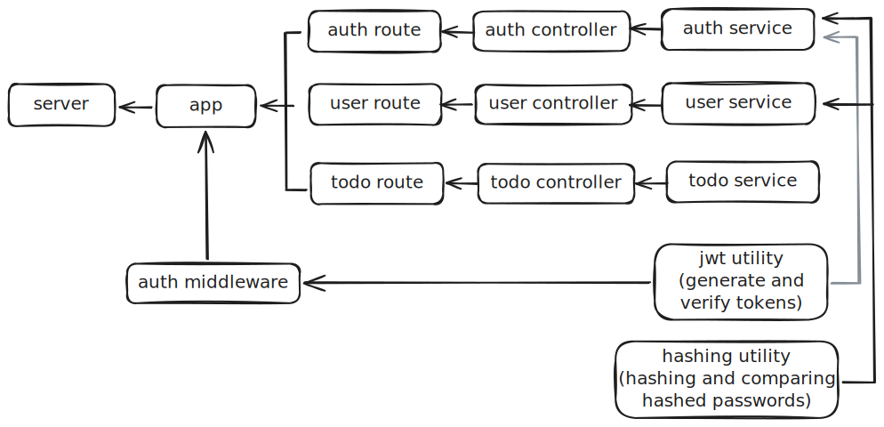

# Simple CRUD Todo List API App, With JWT Authintication.

## Built with Node, Express, TypeScript, Prisma, and PostgreSQL.

this project is the backend part of a PERN stack app, and it contains:

* A simple REST API in Express that serve users and there todo lists.
* Authintication with bycript and jsonwebtoken libs.

to use this project (it will run on localhost:3000):
* clone it on your disk.
* in the terminal of your code editor, run: npm start.

## 🏗 Project Architecture

## 🛣 API Endpoints

### 🔐 Authentication
| Method | Endpoint | Description | Auth Required |
| :--- | :--- | :--- | :--- |
| POST | `/api/v1/auth/register` | Register a new user | No |
| POST | `/api/v1/auth/login` | Login and get JWT token | No |

### 👤 Users
| Method | Endpoint | Description | Auth Required |
| :--- | :--- | :--- | :--- |
| GET | `/api/v1/users` | Get user profile using id from token | Yes |
| PATCH | `/api/v1/users` | Update user password | Yes |

### 📝 Todos
| Method | Endpoint | Description | Auth Required |
| :--- | :--- | :--- | :--- |
| GET | `/api/v1/todos` | Get all todos for the logged-in user | Yes |
| POST | `/api/v1/todos` | Create a new todo | Yes |
| PATCH | `/api/v1/todos/:id` | Update a todo (content/status) | Yes |
| DELETE | `/api/v1/todos/:id` | Delete a specific todo | Yes |

---

### 🚀 Testing with Postman
You can test all the endpoints directly using our Postman Collection:
1. Download the [Postman Collection](./postman/collection.json).
2. Import it into your Postman app.
3. Set your environment variables and start testing!